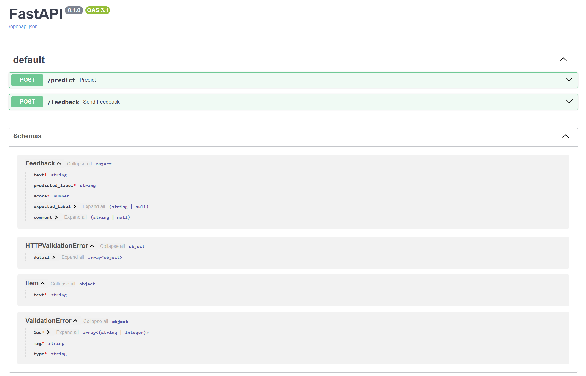
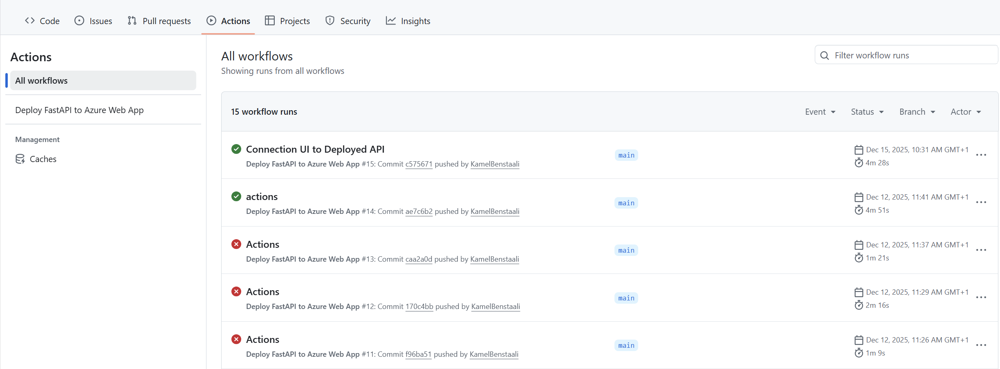
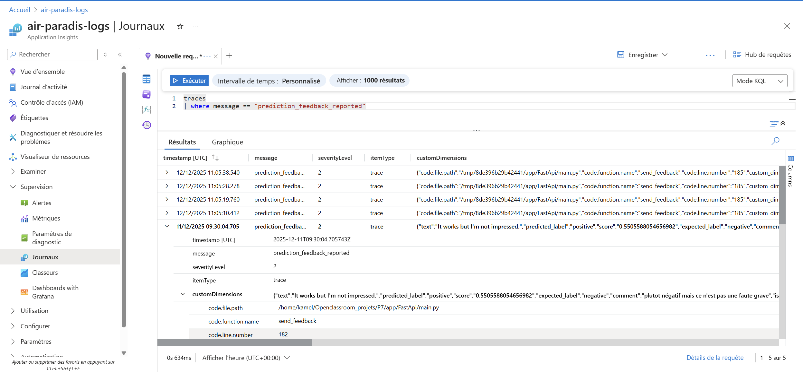
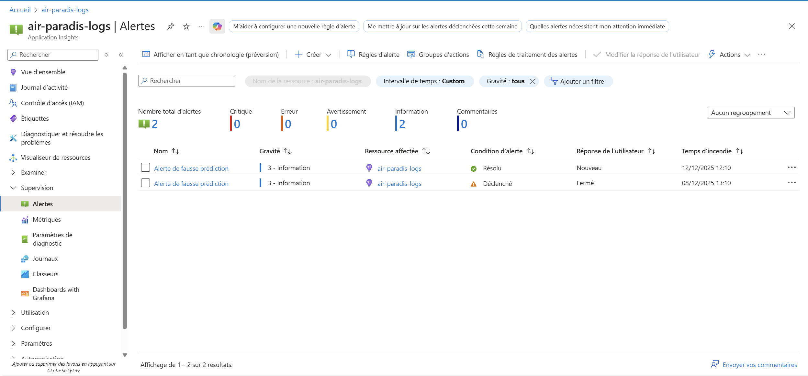
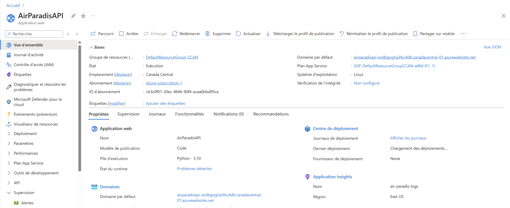
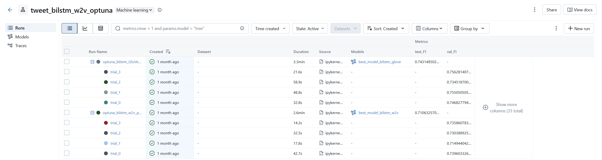
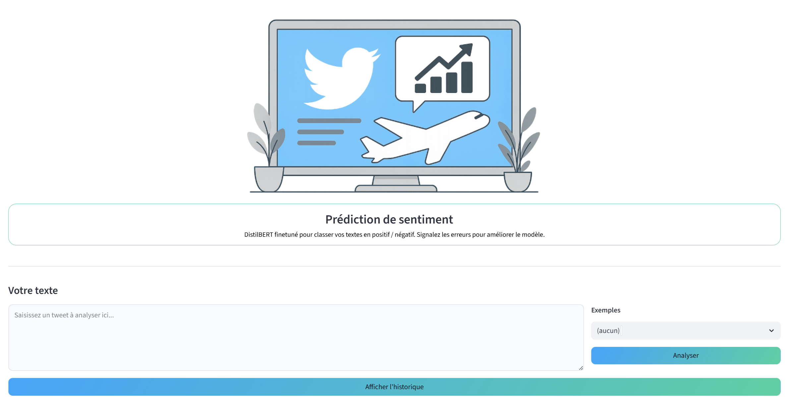

# Analyse de Sentiments de Tweets grâce au Deep Learning : Une Approche MLOps

Cet article décrit la réalisation d'une mission du parcours de la formation [AI Engineer](https://openclassrooms.com/fr/paths/795-ai-engineer) d'[OpenClassrooms](https://openclassrooms.com/fr/), et qui est d'analyser les sentiments de tweets.

# Description de la mission
## Contexte
Dans ce projet, on est ingénieur IA chez MIC ( Marketing Intelligence Consulting), entreprise de conseil spécialisée en marketing digital.

Notre client, ✈️ Air Paradis (compagnie aérienne), souhaite anticiper les bad buzz sur les réseaux sociaux, donc celle ci a demandé à développer un produit IA permettant de prédire le sentiment associé à un tweet, pour mieux voir sa réputation en ligne.

## Mission

Créer un prototype fonctionnel d'un modèle d'analyse de sentiments pour tweets selon trois approches différentes :

1. **Modèle sur mesure simple** : Approche classique (régression logistique) pour une prédiction rapide
2. **Modèle sur mesure avancé** : Utilisation de réseaux de neurones profonds avec différents word embeddings
3. **Modèle avancé USE** : Exploration du modèle USE (v4 qui contient une architecture transformer)
4. **Modèle avancé BERT** : Exploration de l'apport en performance d'un modèle BERT

Cette mission implique également la mise en œuvre d'une démarche MLOps complète :

- Utilisation de MLFlow pour le tracking des expérimentations et le stockage des modèles.

- Création d'un pipeline de déploiement continu (Git + Github + plateforme Cloud).

- Intégration de tests unitaires automatisés.

- Mise en place d'un suivi de performance en production via Azure Application Insight.

# 🔧 Technologies utilisées

- Langages : Python
- Bibliothèques ML/DL : Scikit-learn, TensorFlow/Keras, Transformers (BERT), Torch
- MLOps :
    - Tracking : MLFlow
    - CI/CD : Git, GiHub Actions
    - Cloud : Azure Web Application (ASP F1)
- Backend : FastAPI
- Frontend : Streamlit
- Monitoring : Azure Application Insight
- Traitement texte : NLTK, Word Embeddings

# Structure du projet
Le dépôt P7 est organisé pour séparer clairement exploration, code applicatif et documentation, tout en restant lisible pour le MLOps.

Ce dépôt est disponible ici:
[Github](https://github.com/KamelBenstaali/OpenClassroomP7)

- `Documentation/` : articles et guides (Azure, monitoring, setup).
- `Mes_notebooks/` : notebooks des 4 approches (EDA + simple, BiLSTM, USE, DistilBERT), quantification DistilBERT et notebook 6 (comparatif d’inférence/RSS).
- `.github/workflows/` : CI/CD GitHub Actions via `azure-webapp.yml` qui installe les dépendances FastAPI, lance `pytest tests/test_main.py`, construit une archive et déploie l'API sur Azure App Service (login avec le secret `AZURE_CREDENTIALS`).
- `app/` : code produit avec `FastApi` pour le backend et `FrontEnd` pour l’interface utilisateur.
- `tests/` : tests automatisés.
- Fichiers racine : `requirements.txt`, `ReadMe.md` pour l’installation/la prise en main, et `.gitignore` pour exclure données volumineuses et artefacts.

Schéma rapide (répertoires principaux uniquement) :
```
P7
├─ .github/
│  └─ workflows/
│     └─ azure-webapp.yml
├─ Documentation/
├─ Mes_notebooks/
│  ├─ Model_1_simple/
│  ├─ Model_2_advanced/
│  ├─ Model_3_USE/
│  ├─ Model_4_DISTILBERT/
│  └─ Model_4_DISTILBERT_quant/
│  └─ notebook_06.ipynb
├─ app/
│  ├─ FastApi/
│  └─ FrontEnd/
├─ tests/
├─ .gitignore
├─ ReadMe.md
└─ requirements.txt
```


# Analyse exploratoire des tweets
Le notebook `Mes_notebooks/Model_1_simple/notebook_01.ipynb` synthétise l'EDA réalisée sur l'ensemble d'entraînement Sentiment140 (1,6 M de tweets, 6 colonnes). Aucun doublon ni valeur manquante n'a été détecté, les classes sont parfaitement équilibrées (800 k négatifs codés `0` et 800 k positifs codés `4`) et la colonne `query` ne contient que `NO_QUERY`, ce qui a conduit à ne conserver que les variables `sentiment` et `tweet` pour la suite.

Principales analyses menées :
- Nuages de mots et top 20 uni-grammes séparés par polarité pour visualiser le vocabulaire dominant dans chaque classe.
- Longueur des tweets : moyenne ≈74 caractères et ≈13 mots, distributions de taille similaires entre sentiments.
- Marques lexicales et ponctuation : 
    - formes négatives (not/never/...) beaucoup plus présentes dans les tweets négatifs (≈69 % des occurrences) ;
    - les points d’exclamation dominent côté positif (≈36,6 %), les points d’interrogation sont neutres, les ellipses `...` apparaissent davantage dans le négatif (≈11,3 %).
- Emoticônes : les tweets positifs contiennent majoritairement des emoticônes positives (≈87,4 %) ; même dans les tweets négatifs, les emoticônes positives restent majoritaires (≈69 %).
- Hashtags/URLs/@mentions : ces éléments sont tous plus fréquents dans les tweets positifs (mentions ≈59,9 %, URLs ≈67,2 %, hashtags ≈58,3 %), suggérant une communication plus interactive/promotionnelle côté positif.
- Usage de majuscules : les expressions entièrement en MAJUSCULES sont légèrement plus présentes dans les tweets positifs (≈52,2 % vs 47,8 %), indice d’une expressivité plus forte.

Ces observations orientent le jeu de features retenu pour le modèle classique (comptes de ponctuation, majuscules, hashtags/URLs/mentions, longueur, formes négatives, emoticônes), combinés ensuite aux représentations TF‑IDF.

# Modélisations

Lors de chaque modelisation, nous avons entrainé un model sur un échantillon de données puis nous avons évalué le modèle sur des métriques de base (Accuracy, rappel, F1_score, ...).

Nous avons ajouté un test sur des tweets définis pour voir les capacités de chaque modèle sur des tweets représentatifs (on note l'accuracy seulement).

Lors de notre benchmark, nous comparerons 3 métriques: Accuracy, F1_score, Accuracy sur les tweets personnalisés.

## Modélisation Approche Simple
Le notebook `Mes_notebooks/Model_1_simple/notebook_01.ipynb` met en place une version “classique” du modèle pour disposer rapidement d’un premier benchmark.

- **Nettoyage du texte** : on simplifie l’écriture (minuscules, contractions, émojis → mots), on retire liens, mentions, hashtags et caractères parasites, puis on enlève les mots vides pour garder l’essentiel du message.
- **Échantillon de travail** : pour aller vite, on prend un extrait équilibré de 16 000 tweets (moitié négatifs, moitié positifs) issu du jeu nettoyé.
- **Ce qu’on mesure dans chaque tweet** : taille du message, présence de mots négatifs, hashtags/URLs/mentions, ponctuation marquante (`?`, `!`, `...`), passages en MAJUSCULES.
- **Représentation du texte** : on transforme les mots en nombres (pondération TF‑IDF) et on ajoute les mesures précédentes pour enrichir la description.
- **Entraînement et choix du modèle** : plusieurs variantes de régression logistique sont testées (Avec différentes standardisations de données). La meilleure combine les deux familles de signaux (texte + indicateurs simples) et sert de référence pour les approches plus avancées.


## Modélisation Approche avancée
Le notebook `Mes_notebooks/Model_2_advanced/notebook_02.ipynb` pousse plus loin l’apprentissage en utilisant des réseaux BiLSTM et des vecteurs de mots pré-entraînés.

- **Nettoyage léger** : on simplifie le texte (minuscules, transformation des émojis/emoticônes en mots, retrait des liens/mentions/hashtags/nombres) tout en gardant la ponctuation et les mots de liaison pour préserver le contexte.
- **Jeu de travail équilibré** : 8 000 tweets négatifs et 8 000 positifs (comme pour l’approche simple), re-étiquetés en 0/1 puis découpés en train/validation/test.
- **Représentation du texte** : découpage des tweets en séquences de mots, limitation du vocabulaire aux 20 000 termes les plus fréquents, et longueur standardisée (80 tokens) pour alimenter les réseaux.
- **Deux variantes de BiLSTM pré-entraînées** :
  - *Word2Vec GoogleNews* (300 dimensions, embeddings fixés) : recherche des meilleurs réglages avec Optuna + early stopping, meilleure F1 validation ≈0,74.
  - *GloVe* (embeddings 50–100 dimensions, certains entraînés) : meilleure F1 validation ≈0,76, test global ≈0,75 de précision/≈0,74 de F1.
  Toutes les expériences sont suivies dans MLflow et exportées en packages prêts à servir.

## Modélisation USE
Le notebook `Mes_notebooks/Model_3_USE/notebook_03.ipynb` teste l’encodeur de phrases Universal Sentence Encoder (USE) de Google pour transformer chaque tweet en vecteur dense avant de le passer à un petit réseau de neurones.

- **Nettoyage léger** : texte en minuscules, émojis/emoticônes convertis en mots, suppression des liens/mentions/hashtags et des nombres, tout en conservant la ponctuation pour garder le ton.
- **Jeu de travail** : même base équilibrée que les approches précédentes (8 000 tweets négatifs et 8 000 positifs), découpée en entraînement/validation/test.
- **Encodage USE** : les tweets normalisés sont encodés une seule fois avec USE (512 dimensions), ce qui fournit directement une représentation “sens” de la phrase, sans calculer de n‑grammes ni d’embeddings maison.
- **Modèle entraîné** : un petit réseau dense (dropout + couche cachée + sortie sigmoïde) est ajusté avec Optuna pour choisir notamment la taille de la couche cachée et le taux de dropout, avec arrêt anticipé pour éviter le surapprentissage.


## Modélisation Distilbert
Le notebook `Mes_notebooks/Model_4_DISTILBERT/notebook_04.ipynb` exploite DistilBERT pour capter le contexte complet des phrases.

- **Nettoyage minimal** : on se contente d’enlever les espaces superflus, sans toucher à la casse ni à la ponctuation pour ne pas perdre d’indice de ton.
- **Jeu de travail élargi** : 20 000 tweets négatifs + 20 000 positifs (équilibrés), puis découpe train/validation/test.
- **Préparation texte** : normalisation légère après le split, conversion en format `Dataset` Hugging Face, tokenisation avec le tokenizer DistilBERT.
- **Fine-tuning** : entraînement de `distilbert-base-uncased-finetuned-sst-2-english` via la Trainer API avec suivi MLflow. Après une courte passe d’entraînement, on obtient une F1 de validation autour de 0,83.
- **Déploiement optimisé** : ajout d’une version quantifiée dynamiquement du modèle pour réduire la taille et accélérer l’inférence.

Le notebook `Mes_notebooks/notebook_06.ipynb` complète l’évaluation en lançant une inférence par modèle sauvegardé et en mesurant le pic de mémoire RSS pour comparer le coût RAM des pipelines.

# BenchMarking des modèles

| Modèle                                | F1 validation | F1 test | Accuracy tweets difficiles | Commentaire rapide                                    |
|---------------------------------------|---------------|---------|----------------------------|-------------------------------------------------------|
| LogReg TF‑IDF (+ features simples)    | ≈0,73         | ≈0,74   | ≈0,70                      | Baseline légère, facile à servir                      |
| BiLSTM Word2Vec                       | ≈0,74         | ≈0,71   | ≈0,70                      | Capte le contexte, améliore légèrement la robustesse  |
| BiLSTM GloVe                          | ≈0,76         | ≈0,74   | ≈0,73                      | Meilleur équilibre BiLSTM, mais sensible au sarcasme  |
| USE + réseau dense                    | ≈0,78         | ≈0,79   | ≈0,78                      | Plus léger que BiLSTM, robuste sur cas piégeux        |
| DistilBERT (version de base & quantizé) | ≈0,82       | ≈0,82   | ≈0,85                      | Meilleure précision et robustesse globale             |

D'aprés ce comparatif de performances, et avec le test de consommations fait dans le "notebook_06", DISTILBERT (quantizé) représente le meilleur compromis performance/consommation et le modele qu'on choisit pour le déploiement.

# Architecture de l'application

## **API (FastAPI)**



  - **Endpoints** : `/predict` (retourne label + score après nettoyage du texte) et `/feedback` (remonte les retours utilisateurs avec le texte, le label attendu et un commentaire éventuel).

  - **Tests** : `tests/test_main.py` vérifie le prétraitement, le chargement du modèle, les réponses des endpoints et la journalisation des feedbacks.

  - **Mise en œuvre du MLOps** : principes de test/trace/déploiement automatisés.  
    - Principes : versionner code + modèles, tracer les expériences, tester en continu, déployer automatiquement.

    - Application :
      - GitHub Actions (`azure-webapp.yml`) installe les dépendances FastAPI, lance `pytest tests/test_main.py`, zippe l’API + modèle ONNX/tokenizer, pousse l’archive sur App Service et applique la commande de démarrage/`WEBSITES_PORT`.
      
      **Interface montrant les github actions**
      

      - Suivi des retours via Azure Monitor/Application Insights (`configure_azure_monitor` + logs `prediction_feedback_reported` avec `custom_dimensions`).

      **Logs**
      

      **Alertes**
      
      
      - Déploiement de l’API sur Azure App Service (ASP F1).

      **ASP dashboard**
      

      - Tracking des expériences et artefacts avec MLflow.

      **MLFLow lors du stockage des modelisations BITSLM**
      

## **UI (Streamlit)**
  - Composants principaux :
      - Zone de saisie du tweet.
      - Affichage du résultat de prédiction avec possibilité de signaler une erreur.
      - Historique des tweets analysés.



  - Les appels API, la persistance d’historique et le feedback utilisateur sont couverts par `tests/test_streamlit_app.py`.


# Stratégie d'amélioration continue du modèle

- Boucler avec les retours utilisateurs : stocker les feedbacks (prédiction correcte/incorrecte) et réentraîner périodiquement avec ces exemples difficiles pour réduire les erreurs sur le terrain (appliquer le concept du retraining du MLOps).

# Conclusion

Grâce aux différentes modèlisations , nous avons pu observer la différence entre les types de modèle en confirmant la supèriorité des transformers. La chaîne MLOps (tests, tracking MLflow, CI/CD, monitoring Azure, déploiement sur App Service) permet de les faire évoluer rapidement et de façon fiable.
Les gains futurs passeront par l’intégration continue des feedbacks terrain pour le reentrainement du modele, ainsi que d'autres options comme l'enrichissement des données.
Ce socle offre une base solide pour proposer des solution fiables à des cas d'utilisation comme celui de notre client (AirParadis).
